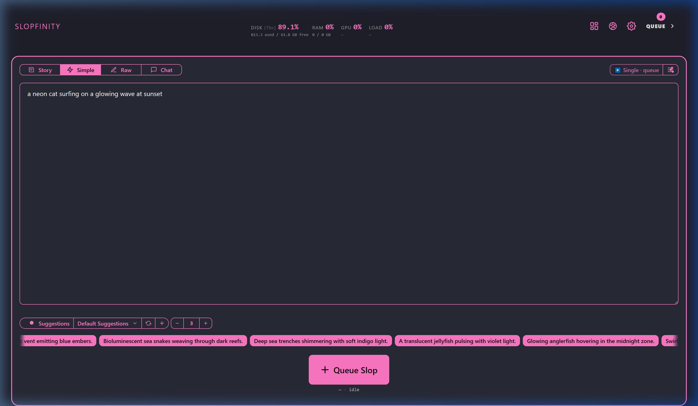
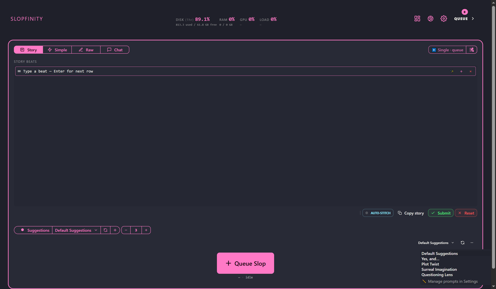
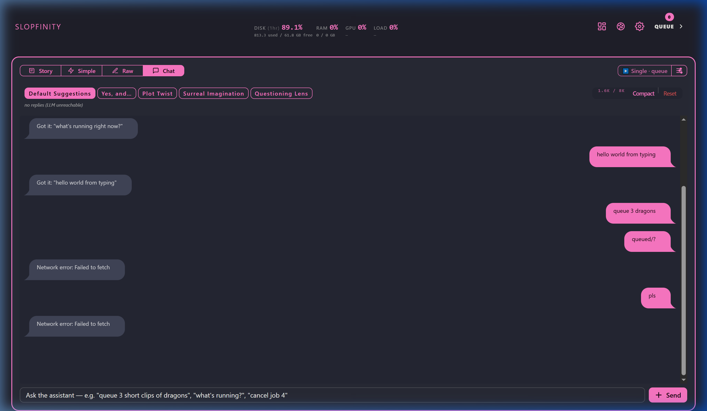

# Slopfinity Suggestion UI Reference

This document serves as a visual regression reference and codebase documentation for the suggestion system UI components in Slopfinity. It details the suggestion behaviors, user controls, and UI states across all three suggestion modes (Simple, Endless/Story, and Chat), with embedded baseline visual evidence.

---

## 1. Suggestion Modes & UI Layouts

### Simple Mode Suggestions
In **Simple Mode**, suggestions are rendered as a continuous horizontal marquee row of interactive chips directly below the main Subjects input textarea. 
* **User Controls**:
  - **Suggestions Toggle**: Enables or disables the suggestion row visibility.
  - **Prompt Selector**: Clicking the active prompt name (under the Subjects textarea) opens the popover prompt picker, where users can choose from active system prompt templates or the default override.
  - **Prompt Count Controls**: Allows setting the batch size ($N$).
  - **Refresh Button**: Triggers a manual fetch of the suggestion batch with the currently selected prompt.

#### Baseline Visual (Simple Mode)

---

### Endless / Story Mode Suggestions
In **Endless/Story Mode**, the UI displays suggestions as structured story beats.
* **User Controls**:
  - **Individual Row Prompts**: Every row can be individually configured with its own prompt ID. The row-lead dropdown displays the prompt template title and can be clicked to change the prompt specifically for that row.
  - **Unified Fallback**: When no custom row prompt is selected, rows fall back to the default suggestion prompt or first active prompt.

#### Baseline Visual (Endless/Story Mode)

---

### Chat Mode Suggestions
In **Chat Mode**, the horizontal marquee is replaced by a row of prompt selection pills container (`#chat-suggest-prompt-pills`) at the top of the chat panel.
* **User Controls**:
  - **Prompt Pills**: Displays a list of all active prompts starting with **Default Suggestions**. The active selection is rendered as a solid primary button, while inactive choices are styled as outline pills.
  - **Tone/Prompt Invalidation**: Clicking a prompt pill immediately switches the chat suggestions' tone to match the chosen prompt template.

#### Baseline Visual (Chat Mode)

---

## 2. Default Suggestions & Prompt Selection Hierarchy

### Prompt Resolution Flow
The suggestion generation backend `/subjects/suggest` resolves prompt configurations via the following hierarchy:
1. **Prompt ID Parameter**: If `prompt_id` is passed as a query string parameter, the server looks up the custom template stored in `config.suggest_prompts`.
2. **Default Suggestion Prompt**: If `prompt_id` is empty (`""`), it maps to **Default Suggestions**, falling back to the default prompt defined in settings, environment config, or built-in system defaults.

### UI Fallback Representation
- On first load or when no custom override is set, the prompt badge correctly displays **Default Suggestions**.
- The selector popovers in Simple and Endless modes, and the pills in Chat mode, always include **Default Suggestions** as the first option.
